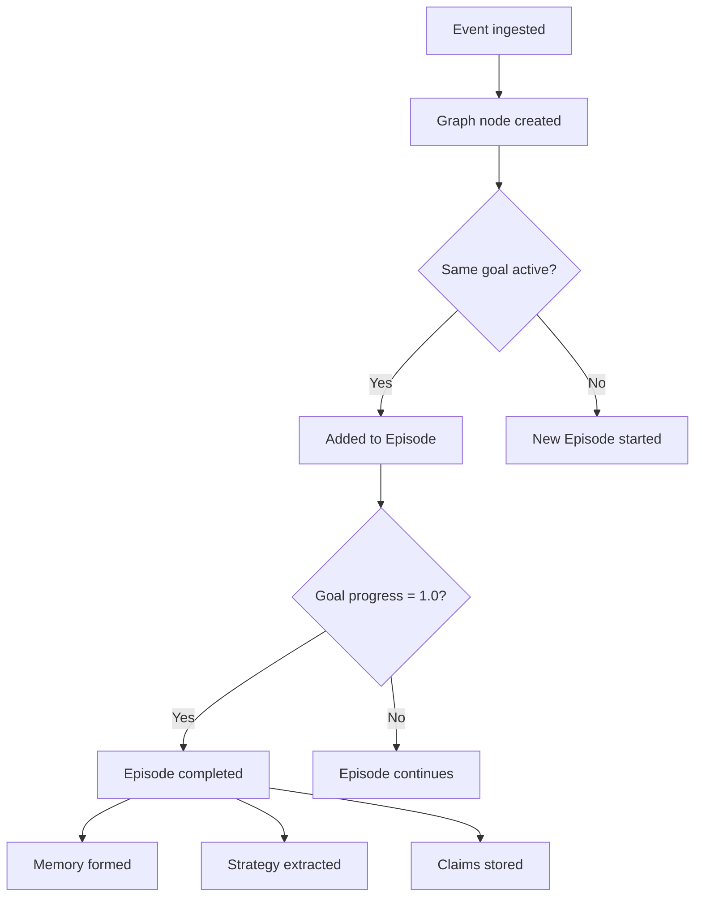

EventGraphDB models the full lifecycle of an agentic interaction. Here are the six core primitives you need to know.

## Events

An **Event** is an atomic interaction — a user message, an AI action, a sensor reading, or a reasoning step. Every piece of data enters EventGraphDB as an event.

Events carry rich context including:
- **Who** — the agent and session that produced the event
- **What** — the event type and payload (Action, Observation, Communication, Cognitive, Learning, or Context)
- **Why** — the active goals driving the interaction
- **Where** — the environmental state at the time of the event

```typescript
// A Communication event logged by the SDK
await client.event("movie-bot", { agentId: 1, sessionId: 5001 })
  .context("I want to book Interstellar for tonight.", "conversation")
  .goal("book_movie", 5)
  .send();
```

## Episodes

An **Episode** is a sequence of events forming a coherent task. EventGraphDB automatically groups events that share the same active goal into episodes.

When a goal's `progress` field reaches `1.0`, the episode is marked as complete and becomes a candidate for long-term memory.

<Info>
  You control episode boundaries by updating the `progress` field on your goals. Set `progress: 0.0` at the start and `progress: 1.0` when the task is done.
</Info>

## Goals

A **Goal** is the objective driving an episode. Goals are embedded in every event's `context.active_goals` array, which lets EventGraphDB understand that a `Communication` event and an `Action` event belong to the same task.

| Field | Type | Description |
| :--- | :--- | :--- |
| `id` | `u64` | Unique goal identifier |
| `description` | `String` | Human-readable description (e.g., `"book_movie"`) |
| `priority` | `f32` | Priority level (`0.0` to `1.0`) |
| `progress` | `f32` | Completion progress (`0.0` to `1.0`) |
| `deadline` | `u64 \| null` | Optional deadline timestamp |
| `subgoals` | `u64[]` | IDs of child goals |

## Memory

A **Memory** is the long-term record of a significant episode. Once an episode completes, EventGraphDB consolidates it into a memory that can be recalled later by matching the current context against past contexts.

Memories are typed:
- **Episodic** — a full episode record
- **Working** — short-term, high-relevance memory
- **Semantic** — distilled facts and knowledge
- **Negative** — records of failed approaches to avoid repeating mistakes

<Tip>
  Use the `POST /api/memories/context` endpoint to answer *"What did we do last time we were in this exact situation?"*
</Tip>

## Claims

A **Claim** is an atomic fact extracted from event content — for example, *"User prefers Sci-Fi movies"* or *"Seat H12 was booked successfully."*

Claims are extracted automatically when you set `enable_semantic: true` on event submission. They power the semantic search system (`POST /api/claims/search`), which lets you query soft knowledge using natural language.

## Strategies

A **Strategy** is a learned behavioral pattern extracted from successful episodes. If an agent repeatedly follows the same sequence of actions to achieve a goal, EventGraphDB distills that pattern into a reusable strategy.

Strategies include:
- **Reasoning steps** — the ordered sequence of decisions
- **Quality score** — how well the strategy performs
- **Preconditions** — when the strategy applies
- **Action hints** — what to do next

<Tip>
  Use `POST /api/strategies/similar` to share successful patterns across different agents. If one agent learned how to handle a payment error, another can discover that strategy automatically.
</Tip>

## Putting it all together



## Next steps

<CardGroup cols={2}>
  <Card title="Quickstart" icon="rocket" href="/quickstart">
    Set up the SDK and log your first event.
  </Card>
  <Card title="Event types reference" icon="list" href="/api-reference/events/event-types">
    Deep dive into every event type variant.
  </Card>
</CardGroup>
