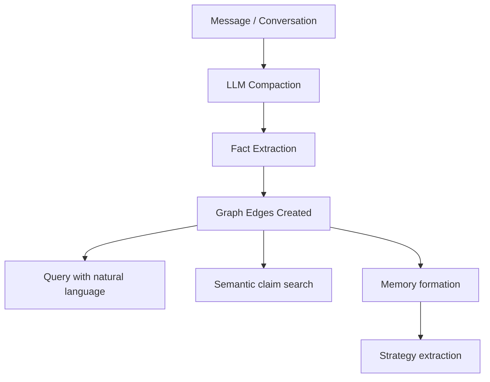

Minns Memory Layer turns conversations into structured, queryable knowledge. Here are the core concepts you need to know.

## Messages & Conversations

The two primary ways to get data into Minns:

- **Messages** (`sendMessage()`) — send individual messages as they arrive in real time. Each message is processed immediately and buffered for deferred LLM compaction.
- **Conversations** (`ingestConversations()`) — ingest multiple sessions at once with inline LLM compaction. Use this for bulk or historical data.

Both methods produce the same result: structured facts written as graph edges.

```typescript
// Real-time: one message at a time
await client.sendMessage({
  role: "user",
  content: "Alice: Paid €50 for lunch - split with Bob",
  case_id: "trip_2024",
});

// Bulk: multiple sessions at once
await client.ingestConversations({
  case_id: "trip_2024",
  sessions: [{ session_id: "s1", messages: [...] }],
});
```

## Knowledge extraction

When messages arrive, Minns automatically extracts structured facts using LLM compaction:

| Category | Edge Type | Example |
| :--- | :--- | :--- |
| `location` | `state:location` | `"I'm moving to NYC"` |
| `work` | `state:work` | `"I started a new job at Google"` |
| `financial` | `financial:payment` | `"Alice: Paid €50 for lunch"` |
| `relationship` | `relationship:*` | `"Johnny works with Christopher"` |
| `preference` | `preference:*` | `"I love fantasy novels"` |
| `routine` | `state:routine` | `"I take morning walks in Battery Park"` |

These facts become graph edges that can be queried using natural language.

## Query

Ask questions about the graph in plain English with `query()`. The pipeline classifies your question's intent, resolves entity mentions to graph nodes, and returns a human-readable answer.

```typescript
const answer = await client.query("Who owes whom?");
// → "Bob owes Alice €25.00 for lunch"
```

Supported intents include `FindNeighbors`, `FindPath`, `Aggregate`, `TemporalChain`, `StructuredMemoryQuery`, and more.

## Entity resolution

Minns maintains stable entity identity across messages and sessions. When you use the same `case_id`, "Alice" always resolves to the same graph node — regardless of which message or batch she first appeared in.

## Claims

A **Claim** is an atomic fact extracted from message content — for example, *"User prefers Sci-Fi movies"* or *"Alice paid €50 for lunch."* Claims power the semantic search system (`searchClaims()`), which lets you query soft knowledge using natural language.

## Memory

A **Memory** is a long-term record of a significant experience. Memories are typed:
- **Episodic** — a full episode record
- **Working** — short-term, high-relevance memory
- **Semantic** — distilled facts and knowledge
- **Negative** — records of failed approaches to avoid repeating mistakes

<Tip>
  Use `getContextMemories()` to answer *"What did we do last time we were in this exact situation?"*
</Tip>

## Strategies

A **Strategy** is a learned behavioral pattern extracted from successful episodes. If an agent repeatedly follows the same sequence of actions to achieve a goal, Minns distills that pattern into a reusable strategy.

<Tip>
  Use `getSimilarStrategies()` to share successful patterns across different agents.
</Tip>

## Putting it all together


```mermaid
graph TD
    A[Message / Conversation] --> B[LLM Compaction]
    B --> C[Fact Extraction]
    C --> D[Graph Edges Created]
    D --> E[Query with natural language]
    D --> F[Semantic claim search]
    D --> G[Memory formation]
    G --> H[Strategy extraction]
```

## Next steps

<CardGroup cols={2}>
  <Card title="Quickstart" icon="rocket" href="/quickstart">
    Send your first message and query the graph.
  </Card>
  <Card title="Messages" icon="message" href="/sdk/messages">
    Learn about real-time message ingestion.
  </Card>
</CardGroup>
