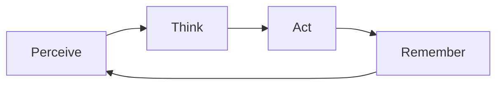
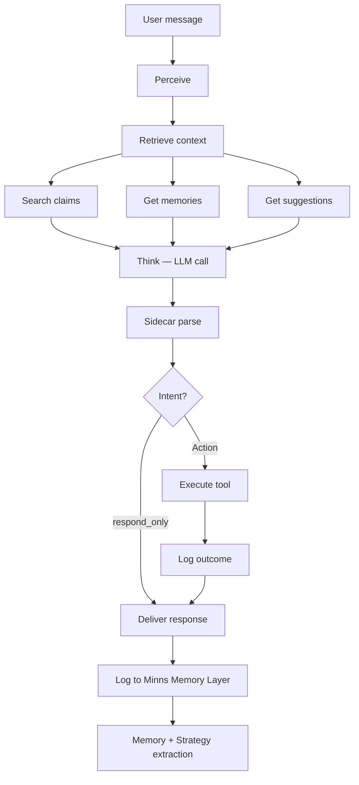

Most "AI chatbots" are stateless wrappers around an LLM. They receive a message, generate a response, and forget everything. A true **agent** is fundamentally different: it perceives, thinks, acts, and *remembers* — building up knowledge over time that makes it better at its job.

This guide walks you through the architecture behind intent-driven agents and builds a complete, production-ready chat agent using `minns-sdk` and Minns Memory Layer.

---

## Part 1: How agents work

### The agent loop

Every agent — from a simple customer service bot to an autonomous research assistant — follows the same core loop:



| Phase | What happens | Example |
| :--- | :--- | :--- |
| **Perceive** | The agent receives input — a user message, a sensor reading, an API callback | User says: "Book me a ticket for Interstellar" |
| **Think** | The agent reasons about what to do — checking memory, evaluating strategies, forming a plan | "I should check seat availability, then ask for seat preference" |
| **Act** | The agent executes a concrete action — calling a tool, sending a response, updating state | Calls `checkAvailability("Interstellar")` |
| **Remember** | The agent logs what happened — the outcome gets stored, patterns get extracted, knowledge gets updated | Stores: "User prefers Sci-Fi", "Booking succeeded" |

A chatbot only does **Perceive → Act**. An agent does all four — and the **Think** and **Remember** phases are what give it intelligence over time.

### Why stateless LLM wrappers fail

Consider a customer who contacts your bot three times:

1. **Monday**: "I like Sci-Fi movies" → Bot responds, forgets.
2. **Wednesday**: "What should I watch?" → Bot has no idea they like Sci-Fi.
3. **Friday**: "I tried to book but it failed" → Bot has no context about the failure.

With an agent backed by Minns Memory Layer, every interaction is stored as an event. The agent forms memories, extracts claims ("User likes Sci-Fi"), and learns strategies ("When booking fails, offer alternative showtimes"). By Friday, the agent *knows* the user, *remembers* the failure, and *has a strategy* for recovery.

---

## Part 2: The intent model

The most critical design decision in an agent is: **how does the LLM's free-form text output translate into structured actions?**

The naive approach is to prompt the LLM to return JSON. This breaks constantly — LLMs hallucinate brackets, forget commas, and wrap JSON in markdown fences. The intent model solves this cleanly.

### The core idea

Instead of asking the LLM to be a JSON serializer, you separate its output into two distinct parts:

1. **The assistant response** — natural language for the user (what the LLM is good at)
2. **The intent block** — a structured action declaration in a fenced, parseable format

The LLM produces both in a single generation. A local parser (the **sidecar**) extracts the intent block without any additional network calls.

```
Hey! I found 3 available seats for Interstellar tonight.
Would you like the aisle seat in row H or the center seat in row J?

---INTENT---
action: show_options
movie: Interstellar
options: ["H12-aisle", "J15-center", "J16-center"]
showtime: 2026-02-06T19:30:00Z
---END---
```

The sidecar parser splits this into:
- `assistantResponse`: `"Hey! I found 3 available seats..."`
- `intent`: `{ action: "show_options", movie: "Interstellar", options: [...] }`

### Why this works

<CardGroup cols={2}>
  <Card title="LLM stays natural" icon="comment">
    The LLM writes prose — which it's great at. It never has to produce valid JSON in isolation.
  </Card>
  <Card title="Parsing is deterministic" icon="bullseye">
    The intent block has rigid delimiters. Parsing is simple string splitting, not fragile JSON extraction.
  </Card>
  <Card title="No extra API calls" icon="bolt">
    The sidecar runs locally. No second LLM call for "function calling" or "structured output."
  </Card>
  <Card title="Fallback is graceful" icon="shield-check">
    If the LLM omits the intent block, you still have a valid assistant response. No crash.
  </Card>
</CardGroup>

### The intent spec

An **intent spec** defines what actions your agent can take. Think of it as the agent's "tool belt." You declare the spec once, and the SDK generates the prompt instructions automatically.

```typescript
const intentSpec = {
  actions: [
    {
      name: "search_movies",
      description: "Search for movies by title, genre, or showtime",
      parameters: {
        query: { type: "string", description: "Search query", required: true },
        genre: { type: "string", description: "Genre filter" },
        date: { type: "string", description: "Date filter (ISO 8601)" },
      },
    },
    {
      name: "check_availability",
      description: "Check seat availability for a specific movie and showtime",
      parameters: {
        movie: { type: "string", required: true },
        showtime: { type: "string", required: true },
      },
    },
    {
      name: "book_ticket",
      description: "Book a ticket for the user",
      parameters: {
        movie: { type: "string", required: true },
        seat: { type: "string", required: true },
        showtime: { type: "string", required: true },
      },
    },
    {
      name: "respond_only",
      description: "No action needed — just respond to the user conversationally",
      parameters: {},
    },
  ],
};
```

The SDK converts this into a clear instruction block that gets appended to the LLM's system prompt. The LLM learns to emit the `---INTENT---` block naturally.

### The agent architecture

Here's the full architecture of an intent-driven agent:



The key insight: **the LLM is just one component**. It sits between the retrieval layer and the execution layer. Memory, strategies, and claims flow *into* the LLM as context, and structured intents flow *out* for execution.

---

## Part 3: Building the agent

Let's build this step by step. By the end, you'll have a working chat agent with memory, knowledge extraction, and strategy-guided behavior.

### Step 1: Project setup

```bash
mkdir movie-agent && cd movie-agent
npm init -y
npm install minns-sdk openai
```

```typescript title="agent.ts"
import { createClient, buildSidecarInstruction, extractIntentAndResponse } from 'minns-sdk';
import OpenAI from 'openai';

const client = createClient({
  baseUrl: "https://your-instance.minns.ai",
  autoBatch: true,
  batchInterval: 100,
  batchMaxSize: 20,
  maxQueueSize: 1000,
});

const openai = new OpenAI({ apiKey: process.env.OPENAI_API_KEY });

const AGENT_ID = 1;
const AGENT_TYPE = "movie-bot";
```

<Info>
  This example uses OpenAI, but the intent model works with **any LLM** — Claude, Llama, Mistral, Gemini, or a local model. The sidecar parser doesn't care which model produced the output.
</Info>

### Step 2: Define the intent spec

Define every action the agent can perform. Be specific — vague actions lead to vague intents.

```typescript title="agent.ts"
const intentSpec = {
  actions: [
    {
      name: "search_movies",
      description: "Search for movies by title, genre, or showtime. Use when the user is browsing or asking what's available.",
      parameters: {
        query: { type: "string", description: "Search terms", required: true },
        genre: { type: "string", description: "Genre filter (e.g., 'sci-fi', 'comedy')" },
        date: { type: "string", description: "Date (ISO 8601)" },
      },
    },
    {
      name: "check_availability",
      description: "Check seat availability for a specific movie and showtime. Use after the user has chosen a movie.",
      parameters: {
        movie: { type: "string", description: "Movie title", required: true },
        showtime: { type: "string", description: "Showtime (ISO 8601)", required: true },
      },
    },
    {
      name: "book_ticket",
      description: "Book a ticket. Use only when the user has confirmed their movie, seat, and showtime.",
      parameters: {
        movie: { type: "string", description: "Movie title", required: true },
        seat: { type: "string", description: "Seat ID (e.g., 'H12')", required: true },
        showtime: { type: "string", description: "Showtime (ISO 8601)", required: true },
      },
    },
    {
      name: "cancel_booking",
      description: "Cancel an existing booking by confirmation ID.",
      parameters: {
        confirmation_id: { type: "string", description: "Booking confirmation ID", required: true },
      },
    },
    {
      name: "respond_only",
      description: "Just respond conversationally. No tool call needed. Use for greetings, clarifications, or when the user's intent is unclear.",
      parameters: {},
    },
  ],
};
```

<Tip>
  Write action descriptions as if you're training a new employee. Include **when** to use each action, not just what it does. This dramatically improves intent accuracy.
</Tip>

### Step 3: Build the system prompt

The system prompt has three layers:

1. **Personality and role** — who the agent is
2. **Sidecar instructions** — how to format the intent block (auto-generated by the SDK)
3. **Dynamic context** — memories, claims, and suggestions injected at runtime

```typescript title="agent.ts"
function buildSystemPrompt(
  sidecarInstruction: string,
  memories: string,
  claims: string,
  suggestions: string
): string {
  return `You are a friendly and knowledgeable movie booking assistant. You help users find movies, check availability, and book tickets.

## Your personality
- Warm and enthusiastic about movies
- Proactive — suggest options, don't just answer questions
- Concise — keep responses under 3 sentences unless the user asks for detail

## What you know about this user
${claims || "No known preferences yet."}

## Relevant past interactions
${memories || "No previous interactions found."}

## Suggested next actions
${suggestions || "No suggestions available — use your best judgment."}

## Intent format instructions
${sidecarInstruction}

IMPORTANT: Always include an intent block in your response, even if the action is "respond_only".`;
}
```

### Step 4: The retrieval layer

Before every LLM call, the agent gathers context from Minns Memory Layer. This is the **Perceive** phase.

```typescript title="agent.ts"
interface AgentContext {
  memories: string;
  claims: string;
  suggestions: string;
  goalProgress: number;
  contextHash?: number;
}

async function gatherContext(
  sessionId: number,
  userId: string,
  currentGoal: string
): Promise<AgentContext> {
  // Run all retrievals in parallel for speed
  const [claimsResult, memoriesResult, strategiesResult] = await Promise.all([
    // Soft facts — what do we know about this user?
    client.searchClaims({
      query_text: `User preferences and history for ${currentGoal}`,
      top_k: 5,
      min_similarity: 0.6,
    }),

    // Past episodes — what happened last time in a similar situation?
    client.getContextMemories(
      {
        active_goals: [
          { id: 101, description: currentGoal, priority: 0.9, progress: 0.0, subgoals: [] },
        ],
        environment: {
          variables: { user_id: userId },
          temporal: { deadlines: [], patterns: [] },
        },
        resources: {
          computational: { cpu_percent: 10, memory_bytes: 1024, storage_bytes: 1024, network_bandwidth: 100 },
          external: {},
        },
      },
      { limit: 3, min_similarity: 0.5 }
    ),

    // Strategies — what worked before?
    client.getSimilarStrategies({
      goal_ids: [101],
      tool_names: ["search_movies", "book_ticket"],
      result_types: [],
      limit: 2,
      min_score: 0.6,
    }),
  ]);

  const claims = claimsResult
    .map(c => `- ${c.claim_text} (confidence: ${c.confidence.toFixed(2)})`)
    .join("\n");

  const memories = memoriesResult
    .map(m => `- [${m.memory_type}] ${m.outcome} (strength: ${m.strength.toFixed(2)})`)
    .join("\n");

  const suggestions = strategiesResult
    .map(s => `- Strategy "${s.name}": ${s.action_hint} (quality: ${s.quality_score.toFixed(2)})`)
    .join("\n");

  return { memories, claims, suggestions, goalProgress: 0.0 };
}
```

<Info>
  The three retrievals run in **parallel** with `Promise.all`. This keeps latency low — you're adding ~1 round-trip to Minns Memory Layer, not 3 sequential ones.
</Info>

### Step 5: The LLM call + sidecar parse

This is the **Think** phase. The LLM receives the enriched prompt and produces both a response and a structured intent.

```typescript title="agent.ts"
interface ParsedTurn {
  assistantResponse: string;
  intent: {
    action: string;
    [key: string]: unknown;
  } | null;
}

async function think(
  userMessage: string,
  conversationHistory: OpenAI.ChatCompletionMessageParam[],
  agentContext: AgentContext
): Promise<ParsedTurn> {
  // Generate sidecar instructions from the intent spec
  const sidecarInstruction = buildSidecarInstruction(intentSpec);

  // Build the full system prompt with dynamic context
  const systemPrompt = buildSystemPrompt(
    sidecarInstruction,
    agentContext.memories,
    agentContext.claims,
    agentContext.suggestions
  );

  // Call the LLM
  const completion = await openai.chat.completions.create({
    model: "gpt-4o",
    messages: [
      { role: "system", content: systemPrompt },
      ...conversationHistory,
      { role: "user", content: userMessage },
    ],
    temperature: 0.7,
    max_tokens: 1024,
  });

  const modelOutput = completion.choices[0]?.message?.content || "";

  // Parse the intent locally — no extra API call
  const { intent, assistantResponse } = extractIntentAndResponse(
    modelOutput,
    userMessage,
    intentSpec
  );

  return { assistantResponse, intent };
}
```

### Step 6: The execution layer

The **Act** phase. Each intent maps to a concrete function. This is where the agent does real work.

```typescript title="agent.ts"
interface ActionResult {
  success: boolean;
  data: unknown;
  error?: string;
}

async function executeIntent(intent: ParsedTurn["intent"]): Promise<ActionResult | null> {
  if (!intent || intent.action === "respond_only") {
    return null; // No tool call needed
  }

  switch (intent.action) {
    case "search_movies":
      return await searchMovies(intent.query as string, intent.genre as string);

    case "check_availability":
      return await checkAvailability(intent.movie as string, intent.showtime as string);

    case "book_ticket":
      return await bookTicket(
        intent.movie as string,
        intent.seat as string,
        intent.showtime as string
      );

    case "cancel_booking":
      return await cancelBooking(intent.confirmation_id as string);

    default:
      return { success: false, data: null, error: `Unknown action: ${intent.action}` };
  }
}

// --- Tool implementations ---

async function searchMovies(query: string, genre?: string): Promise<ActionResult> {
  // Your movie search API call here
  const results = [
    { title: "Interstellar", showtime: "19:30", seats_left: 12 },
    { title: "The Martian", showtime: "20:00", seats_left: 5 },
  ];
  return { success: true, data: { results, count: results.length } };
}

async function checkAvailability(movie: string, showtime: string): Promise<ActionResult> {
  // Your availability API call here
  return {
    success: true,
    data: {
      movie,
      showtime,
      available_seats: ["H12", "H13", "J15", "J16"],
      total_available: 4,
    },
  };
}

async function bookTicket(movie: string, seat: string, showtime: string): Promise<ActionResult> {
  // Your booking API call here
  return {
    success: true,
    data: { confirmation_id: `CONF-${Date.now()}`, movie, seat, showtime },
  };
}

async function cancelBooking(confirmationId: string): Promise<ActionResult> {
  // Your cancellation API call here
  return { success: true, data: { cancelled: confirmationId } };
}
```

### Step 7: The logging layer

The **Remember** phase. Every turn gets logged to Minns Memory Layer — the user message, the agent's reasoning, the action, and the outcome. This is what powers memory formation, claim extraction, and strategy learning.

```typescript title="agent.ts"
async function logTurn(
  sessionId: number,
  userId: string,
  userMessage: string,
  parsed: ParsedTurn,
  actionResult: ActionResult | null,
  goalProgress: number
) {
  // 1. Log the user's message as a Context event (enables claim extraction)
  await client.event(AGENT_TYPE, { agentId: AGENT_ID, sessionId })
    .context(userMessage, "conversation")
    .goal("book_movie", 5, goalProgress)
    .state({ user_id: userId, turn: "user" })
    .enqueue();

  // 2. If there was an action, log it with its outcome
  if (parsed.intent && parsed.intent.action !== "respond_only" && actionResult) {
    const { action, ...params } = parsed.intent;

    if (actionResult.success) {
      await client.event(AGENT_TYPE, { agentId: AGENT_ID, sessionId })
        .action(action, params)
        .outcome(actionResult.data)
        .goal("book_movie", 5, goalProgress)
        .state({ user_id: userId, turn: "action" })
        .enqueue();
    } else {
      // Log failed actions too — they become Negative memories
      await client.event(AGENT_TYPE, { agentId: AGENT_ID, sessionId })
        .action(action, params)
        .goal("book_movie", 5, goalProgress)
        .state({ user_id: userId, turn: "action", error: actionResult.error })
        .enqueue();
    }
  }

  // 3. Log the assistant's response for claim extraction
  await client.event(AGENT_TYPE, { agentId: AGENT_ID, sessionId })
    .context(parsed.assistantResponse, "conversation")
    .goal("book_movie", 5, goalProgress)
    .state({ user_id: userId, turn: "assistant" })
    .enqueue();
}
```

<Tip>
  Use `enqueue()` for logging — it returns immediately and batches events in the background. This keeps the agent loop fast. Reserve `send()` for the final event where you need confirmation.
</Tip>

### Step 8: The main agent loop

Now we wire everything together. This is the complete agent:

```typescript title="agent.ts"
async function runAgent(userId: string) {
  const sessionId = Date.now();
  const conversationHistory: OpenAI.ChatCompletionMessageParam[] = [];
  let goalProgress = 0.0;

  console.log("🎬 Movie Booking Agent ready. Type 'quit' to exit.\n");

  try {
    while (true) {
      // --- PERCEIVE ---
      const userMessage = await getUserInput(); // readline, stdin, websocket, etc.
      if (userMessage.toLowerCase() === "quit") break;

      // Determine the current goal from context
      const currentGoal = "book_movie";

      // Gather context from Minns Memory Layer (parallel retrieval)
      const agentContext = await gatherContext(sessionId, userId, currentGoal);

      // --- THINK ---
      const parsed = await think(userMessage, conversationHistory, agentContext);

      // --- ACT ---
      let actionResult: ActionResult | null = null;
      if (parsed.intent && parsed.intent.action !== "respond_only") {
        actionResult = await executeIntent(parsed.intent);

        // Update goal progress based on what happened
        if (parsed.intent.action === "book_ticket" && actionResult?.success) {
          goalProgress = 1.0; // Booking complete — episode done
        } else if (parsed.intent.action === "check_availability") {
          goalProgress = Math.min(goalProgress + 0.3, 0.9);
        } else if (parsed.intent.action === "search_movies") {
          goalProgress = Math.min(goalProgress + 0.1, 0.5);
        }
      }

      // --- REMEMBER ---
      await logTurn(sessionId, userId, userMessage, parsed, actionResult, goalProgress);

      // Update conversation history for next turn
      conversationHistory.push({ role: "user", content: userMessage });
      conversationHistory.push({ role: "assistant", content: parsed.assistantResponse });

      // Show the response
      console.log(`\nAssistant: ${parsed.assistantResponse}\n`);

      // If the goal is complete, celebrate and reset
      if (goalProgress >= 1.0) {
        console.log("✅ Booking complete! Episode stored. Starting fresh.\n");
        goalProgress = 0.0;
      }
    }
  } finally {
    // CRITICAL: flush any queued events before exit
    await client.flush();
    console.log("Events flushed. Goodbye!");
  }
}

// Start the agent
runAgent("user_99");
```

<Warning>
  The `finally` block with `client.flush()` is essential. Without it, the last batch of events may be lost when the process exits.
</Warning>

---

## Part 4: How the agent improves over time

The agent you just built doesn't just respond — it **learns**. Here's what happens behind the scenes after each conversation:

### Claim extraction

When you log a Context event with `enable_semantic: true` (the default for the SDK), Minns Memory Layer extracts atomic facts:

| User says | Extracted claim |
| :--- | :--- |
| "I love Sci-Fi movies" | "User prefers Sci-Fi genre" |
| "Aisle seats are better for me" | "User prefers aisle seating" |
| "Last time the payment failed" | "User experienced payment failure" |

On the next session, `searchClaims()` retrieves these facts and injects them into the system prompt. The agent *knows* the user before they say anything.

### Episode formation

Because every event carries the same `goal("book_movie", ...)`, Minns Memory Layer groups them into an **episode**. When `goalProgress` hits `1.0`, the episode completes and becomes a candidate for long-term memory.

The next time a similar context appears (same goal, same user), `getContextMemories()` returns the past episode. The agent can say: *"Last time you booked Interstellar row H — would you like the same?"*

### Strategy extraction

After several successful booking episodes, Minns Memory Layer detects a pattern:

> **Strategy: "standard_booking"**
> 1. Greet user, ask for movie
> 2. Search available movies
> 3. Check seat availability
> 4. Confirm and book
>
> Quality: 0.92 | Confidence: 0.88

This strategy appears in `getSimilarStrategies()` and gets injected into the system prompt as a "suggested next action." The agent follows proven recipes instead of improvising every time.

### Negative memory

When a booking *fails* — say the payment gateway is down — the failed episode is stored as a **Negative memory**. The next time the same context appears, the agent retrieves it and can proactively say: *"I notice payments were slow earlier — let me check the status before we proceed."*

---

## Part 5: Production considerations

### Goal detection

In a real agent, the goal isn't always "book_movie." You need to detect the user's intent and map it to a goal:

```typescript
function detectGoal(userMessage: string, claims: string): { id: number; description: string } {
  const message = userMessage.toLowerCase();

  if (message.includes("cancel") || message.includes("refund")) {
    return { id: 201, description: "cancel_booking" };
  }
  if (message.includes("book") || message.includes("ticket") || message.includes("reserve")) {
    return { id: 101, description: "book_movie" };
  }
  if (message.includes("recommend") || message.includes("suggest") || message.includes("what should")) {
    return { id: 301, description: "recommend_movie" };
  }

  return { id: 999, description: "general_assistance" };
}
```

<Tip>
  Always query memories by the correct goal. This prevents the agent from confusing "booking" history with "cancellation" history.
</Tip>

### Conversation windowing

LLMs have limited context windows. For long conversations, trim the history:

```typescript
function trimHistory(
  history: OpenAI.ChatCompletionMessageParam[],
  maxTurns: number = 10
): OpenAI.ChatCompletionMessageParam[] {
  if (history.length <= maxTurns * 2) return history;

  // Keep the first 2 messages (initial context) and the last maxTurns pairs
  const start = history.slice(0, 2);
  const recent = history.slice(-(maxTurns * 2));
  return [...start, { role: "system", content: "[Earlier conversation trimmed]" }, ...recent];
}
```

The beauty of Minns Memory Layer is that trimmed messages aren't lost — they're already stored as events. Claims extracted from early turns persist in semantic memory even after the conversation window moves forward.

### Error handling in the intent parser

The sidecar parser is resilient, but you should handle edge cases:

```typescript
const { intent, assistantResponse } = extractIntentAndResponse(modelOutput, userMessage, intentSpec);

if (!intent) {
  // LLM didn't produce an intent block — treat as conversational
  console.log("No intent detected — responding conversationally.");
  return { assistantResponse: modelOutput, intent: { action: "respond_only" } };
}

if (!intentSpec.actions.find(a => a.name === intent.action)) {
  // LLM hallucinated an action that doesn't exist
  console.warn(`Unknown action "${intent.action}" — falling back to respond_only`);
  return { assistantResponse, intent: { action: "respond_only" } };
}
```

### Multi-agent handoff

If your system has multiple specialized agents (booking, support, recommendations), use strategies to share knowledge:

```typescript
// The support agent can learn from the booking agent's strategies
const bookingStrategies = await client.getSimilarStrategies({
  goal_ids: [101], // booking goal
  tool_names: ["book_ticket"],
  result_types: [],
  limit: 3,
  min_score: 0.5,
});

// Inject into the support agent's prompt
const context = bookingStrategies
  .map(s => `Booking team learned: "${s.action_hint}" (success: ${s.expected_success.toFixed(0)}%)`)
  .join("\n");
```

---

## Summary

| Component | Role | SDK method |
| :--- | :--- | :--- |
| **Intent spec** | Defines what the agent can do | `buildSidecarInstruction(spec)` |
| **Sidecar parser** | Extracts structured intents from LLM output | `extractIntentAndResponse()` |
| **Event builder** | Logs every turn to Minns Memory Layer | `client.event().action().outcome().send()` |
| **Claims** | Soft facts extracted from conversations | `client.searchClaims()` |
| **Context memory** | Past episodes matching the current situation | `client.getContextMemories()` |
| **Strategies** | Learned behavioral patterns | `client.getSimilarStrategies()` |
| **Policy Guide** | What should the agent do next? | `client.getActionSuggestions()` |

The intent model gives your agent a clean separation between *thinking* (LLM) and *doing* (tools). Minns Memory Layer gives it the ability to *remember* and *improve*. Together, they turn a stateless chatbot into an agent that gets better with every conversation.

<CardGroup cols={2}>
  <Card title="Quickstart" icon="rocket" href="/quickstart">
    Get the SDK installed and running.
  </Card>
  <Card title="Sidecar reference" icon="wand-magic-sparkles" href="/sdk/sidecar">
    Deep dive into the sidecar parsing utilities.
  </Card>
  <Card title="Event builder" icon="wrench" href="/sdk/event-builder">
    Full reference for the fluent event builder API.
  </Card>
  <Card title="Query selection" icon="magnifying-glass" href="/guides/query-selection">
    Learn which search to use for every retrieval pattern.
  </Card>
</CardGroup>
