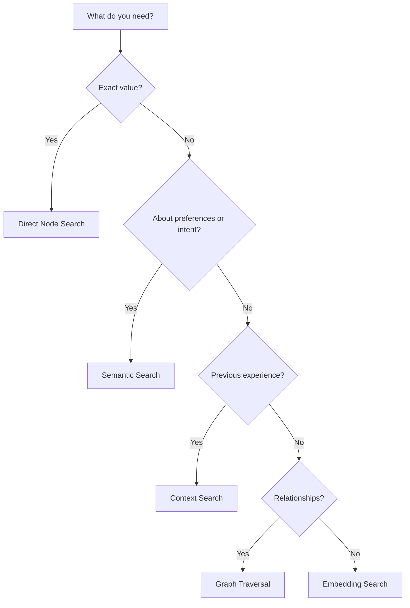

EventGraphDB provides five distinct ways to find data. Choosing the right one is critical for your agent's performance.

## Quick reference

| If you want to find... | Use this search | Accuracy |
| :--- | :--- | :--- |
| Member number, email, or ID | **Direct node search** | Exact |
| "Does the user like popcorn?" | **Semantic search** | Fuzzy |
| "Where did we leave off?" | **Context search** | High |
| "What's the booking history?" | **Graph traversal** | Exact |
| "How do I solve this error?" | **Embedding search** | Fuzzy |

---

## 1. Direct node search (hard facts)

**Endpoint:** `GET /api/graph` or `GET /api/graph/context`

A deterministic lookup for specific nodes and properties via graph traversal. Use this for exact values like member numbers, email addresses, and IDs.

```bash
GET /api/graph?session_id=5001&limit=10
```

<Tip>
  Use graph queries for **hard facts** — data with an exact, verifiable value.
</Tip>

---

## 2. Semantic search (soft facts)

**Endpoint:** `POST /api/claims/search`

A vector-based search over claims (facts extracted from text). Use this for fuzzy concepts like preferences, mood, complaints, or intent.

```json
{
  "query_text": "What kind of seating does the user prefer?",
  "top_k": 3,
  "min_similarity": 0.7
}
```

<Tip>
  Keep the `query_text` natural. Don't include IDs — filter results in your application code instead.
</Tip>

---

## 3. Context search (task history)

**Endpoint:** `POST /api/memories/context`

Finds previous episodes that match a specific environmental state. Use this to answer *"What did we do last time we were in this exact situation?"*

```json
{
  "context": {
    "active_goals": [{ "id": 101, "description": "book_movie" }],
    "environment": { "variables": { "user_id": "user_99" } }
  }
}
```

<Tip>
  The system uses a context fingerprint (hash) for instant matching. Always query by context and goal to avoid mixing history from different tasks.
</Tip>

---

## 4. Graph traversal (relationships)

**Endpoint:** `GET /api/graph` with filters

Retrieves the graph structure showing nodes and their connections. Use this to explore event causality, episode formation, and entity relationships.

```bash
GET /api/graph?session_id=5001&limit=100
```

The response includes both nodes and edges, showing how events are connected through typed relationships like `CausedBy`, `PartOf`, and `LeadsTo`.

---

## 5. Embedding search (strategy similarity)

**Endpoint:** `POST /api/strategies/similar`

Finds learned strategies that "look like" the current goal. Use this when the agent is stuck and needs a successful recipe from a similar task.

```json
{
  "goal_ids": [202],
  "tool_names": ["payment_gateway"],
  "min_score": 0.8
}
```

<Tip>
  This is how you share wisdom between agents. If one agent learned how to handle a payment error, another can find that strategy here.
</Tip>

---

## Decision flowchart



## Best practices

1. **Use graph queries for hard facts** — member numbers, IDs, exact values
2. **Use semantic search for soft facts** — preferences, mood, intent
3. **Always query by context and goal** — prevents mixing history from different tasks
4. **Store filterable fields in metadata** — `user_id`, `session_type`, etc.
5. **Use strategy similarity to share knowledge** — across agents and tasks
